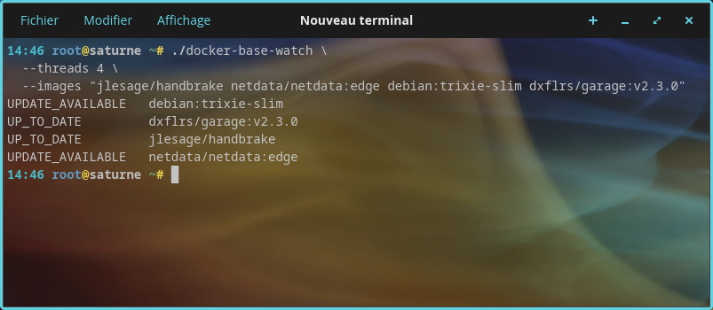

# docker-base-watch

`docker-base-watch` is a small GOLANG CLI tool that allows to easily determine if some docker images have newer versions available in upstream docker registries.



## Features

- Can check one or multiple images at the same time
- Multi-threadable to speed up analysis
- Assumes `:latest` when no tag is provided
- Can be executed multiple times with same results (i.e., does not rely on pulling the parent docker image, but is comparing the local digest of the image and the remote one)
- Unix "one tool-one feature" principle (can be combined with other steps in CI/CD tasks, ..., by relying on exit codes or on outputs)
- Detects credentials of parent docker registries from `~/.docker/config.json

## Usage

### Basic usage

Just launch the program by providing one image (`--image <image>`) or multiple ones (`--images <image1>,<image2>` - can be comma-separated or space-separated).

Note : if the image tag is omitted, `docker-base-watch` will automatically use `:latest`.

```bash
# One image
docker-base-watch -i "nginx"
docker-base-watch --image "nginx:latest"

# Multiple ones
docker-base-watch --images "alpine,nginx"
docker-base-watch --images "alpine nginx"
```

### Processing the results

You can either rely on the output, which can easily be post-processed. Or rely on the unix exit code.


#### With the generated output

| Image Status           | Explanation                                                                                              |
|------------------------|----------------------------------------------------------------------------------------------------------|
| **UP_TO_DATE**         | The local image has no available update in the remote registry                                           |
| **NOT_FOUND_IN_LOCAL** | The image to analyze has never been locally pulled                                                       |
| **UPDATE_AVAILABLE**   | There is an update available in the remote registry                                                      |
| **ERROR**              | Error when doing the query. Relaunch the command with the `-v`/`--verbose` flag to have more details     |

Example : 

```bash
docker-base-watch --images "node:24-alpine ghcr.io/esphome/esphome alpine postgres" 
UP_TO_DATE         alpine
UPDATE_AVAILABLE   ghcr.io/esphome/esphome
UPDATE_AVAILABLE   node:24-alpine
NOT_FOUND_IN_LOCAL postgres
exit status 1
```

#### With error codes

| Error code  | Explanation                                                                     |
|-------------|---------------------------------------------------------------------------------|
| **0**       | Execution successful, and no update available for any analyzed image            |
| **1**       | Execution successful, and at least one image has some available updates         |
| **2**       | Execution aborted due to incorrect input parameters at command line level       |
| **3**       | Execution successufl, but nothing has been done (`--version` being used, etc.)  |
| **4**       | Execution aborted due to some encountered errors. Relaunch the command with the `-v`/`--verbose` flag to have more details |

Example : 

```bash
% docker-base-watch -i nginx
NOT_FOUND_IN_LOCAL nginx
% echo $?
4
```

Note : when launched with the `-q`/`--quiet` flag, no outputs are generated, but error codes are still the same.

```bash
% docker-base-watch -i nginx -q
% echo $?
4
```

### Multithreading

By default, only 1 thread is used, so all requested images are processed in sequence. The execution can be vastly accelerated by adjusting the number of threads.

```bash
docker-base-watch --images "alpine,nginx,archlinux" -q --threads 3
```

Can also be defined with an ENV variable : 

```bash
DOCKER_BASE_WATCH_NB_THREADS=3
docker-base-watch --images "alpine,nginx,archlinux" -q 
```

Benchmark (here with 45 images, in a VPS) : 

```bash
# with 1 thread
0,07s user 0,04s system 0% cpu 28,975 total # 28 seconds

# with 10 threads
0,06s user 0,04s system 2% cpu 3,500 total  # less than 4 seconds
```

### All available flags

```bash
docker-base-watch

  Flags: 
    -h --help       Displays help with available flag, subcommand, and positional value parameters.
    -i --image      Docker image name to check (in this mode, only one information is displayed at the output, about the status of that image)
       --images     Docker image names to check (in this mode, all images are checked, and the output is displaying the list of all images having some updates available)
    -q --quiet      Enable quiet output (final result to be retrieved only through exit value, i.e., echo $?)
    -v --verbose    Enable verbose output
       --version    Display program version
       --jon-logs   logs printed as JSON
    -t --threads    Number of concurrent threads running in parallel (warning : too many threads may lead to errors like 429, etc.) (default: 1)

```

### Example of usage

#### Manually rely on a parent image having an update available

For example, to be used in some CI/CD commands in order to re-build something when a parent image has been updated, etc. - a simplified example could be : 

```bash
BASE_IMAGE=alpine
docker-base-watch -q -i "$BASE_IMAGE"
UPDATE_AVAILABLE=$?
if [[ "$UPDATE_AVAILABLE" -eq 0 ]] ; then
  echo "No newer image for base image [$BASE_IMAGE]"
else
  # do something useful, like rebuilding other docker images, etc.
fi
```

#### Trigger a pull for all images having an update available

```bash
docker-base-watch --images "node:24-alpine ghcr.io/esphome/esphome alpine"  --threads 3 2>/dev/null | grep "UPDATE_AVAILABLE" | while read STATUS IMAGE ; do
  echo "Pulling image [$IMAGE]"
  docker pull $IMAGE
done
```

### Script detecting and updating images when updates are available

As an example, this script can be used as a basis : 

- detect all images from running containers
- find the corresponding docker compose file
- avoid duplicates of image/stack (for docker compose exposing multiple services, etc.)
- relaunch automatically stacks for which an update is needed 

```bash
#!/bin/bash
DOCKER_COMPOSE_FILES_PATH="<path where docker-compose YML files are located>"
NB_THREADS=10

STACKS=/tmp/update.$$
IMAGES=$(docker ps --format '{{.Image}}' | sort -u | tr "\n" ",")
# First pass, identify stack (in docker compose) when an image is available. This is done like this to avoid duplicates of stacks
docker-base-watch --images "${IMAGES}" --threads $NB_THREADS | grep "UPDATE_AVAILABLE" | while read STATUS IMAGE ; do
  docker ps --format '{{.Names}}' --filter "ancestor=${IMAGE}" | sort -u | while read CONTAINER ; do
    grep -l -e "${CONTAINER}:" ${DOCKER_COMPOSE_FILES_PATH}/*.yml | sort -u | while read YAML ; do
      STACK=$(basename "$YAML" | sed 's/\.yml//')
      echo "Registering stack [$STACK] for image [$IMAGE] / container [$CONTAINER] (yml [$YAML])"
      echo "${STACK}" >> "${STACKS}"
    done
  done
done

# Second pass, just use docker compose against the identified YAML / stack files
cat "${STACKS}" | sort -u | while read STACK YAML; do
  echo "Updating STACK [$STACK]"
  docker-compose -f "${DOCKER_COMPOSE_FILES_PATH}/${STACK}.yml" --pull up
done
rm -f "${STACKS}" >/dev/null 2>&1
```


## Notes

- `docker-base-watch` must be executed in an environment where Docker is installed and the Docker daemon is reachable (). That means that in case of docker execution, you need to mount the docker socket : `docker run --rm --name "docker-base-watch" -v /var/run/docker.sock:/var/run/docker.sock:ro docker-base-watch -i nginx`
- If the local image is not present, the tool will report an error from the Docker daemon (`NOT_FOUND_IN_LOCAL`).
- The tool compares image digests to detect whether the local image and remote image refer to the same version (i.e., is not triggering any pull, in order to be idempotent)
- As a consequence, if needed, you still need to pull the image (`docker pull <image>`) in case of updates being detected.

## DEV Activities

### Build

Build the program from source inside the main directory :

```bash
cd ~/docker-base-watch/
make build
```

### Make commands

```bash
build         [DEV] Quick compile the main (linux) binary
clean         [DEV] Clean everything
distribution  [RELEASE] Build the target archive with the expected binaries
docker-build  [RELEASE] Build docker image with multi-stage Dockerfile
docker-run    [DEV] Launch docker image (for local test purpose)
format        [DEV] Format code
help          [HELP] Display commands defined in this makefile
install       [RELEASE] Build all target binaries on all expected platforms
mod           [DEV] Update go modules
nm            [DEV] Analyze symbols in binary (need to remove LDFLAGS -s -w)
run           [DEV] Run the program with DEV configuration
version       [DEV] Extract the version (in go resources way) from binary
```

### Docker

```bash
make docker-build
make docker-run
```

### Release

Update the version/label in the `Makefile`, then : 

```bash
TAG="v1.1.1-SNAPSHOT"
git add .
git commit -m"..."
git push origin master
git tag ${TAG}
git push origin ${TAG}
```


### Overwrite a previous tag

```bash
TAG="v1.1.1-SNAPSHOT"
git tag --delete ${TAG}
git push --delete origin ${TAG}
```
